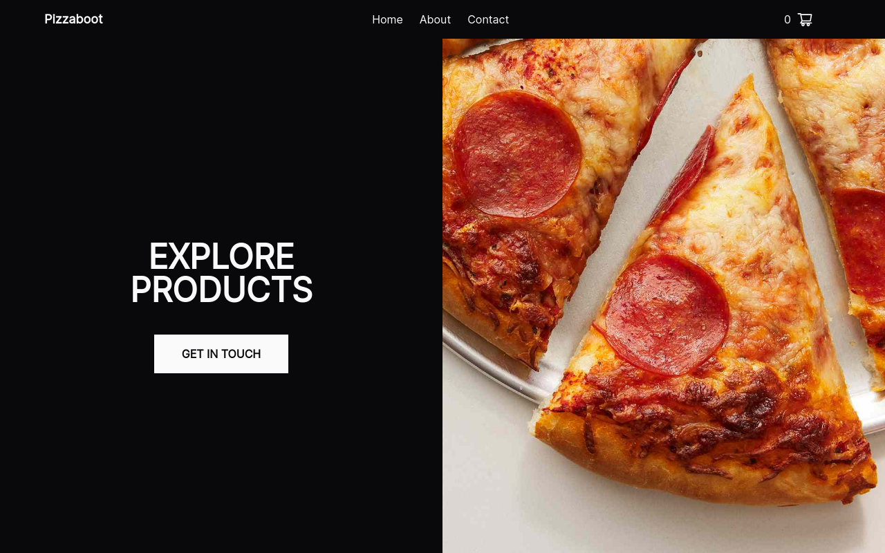

# Delivery service app

Demo is available at: [https://pizza-boot.vercel.app/](https://pizza-boot.vercel.app/).



## Stack

- [React](https://react.dev/)
- [Redux toolkit](https://redux-toolkit.js.org/)
- [React hook form](https://react-hook-form.com/)
- [Tailwindcss](https://tailwindcss.com/)

## Installation

```
npm install
```

Note: for better experience, you need to use [Yandex Maps API][1]. Here, you need to obtain the Geosuggest API, but you can try a different one as it's free to use.

### Setup:

1. Create a `.env` file in the root of your project.
2. Add the following line to the `.env` file:

```
VITE_YANDEX_API_KEY = YOUR_API_KEY_HERE
```

[1]: https://yandex.com/maps-api/
